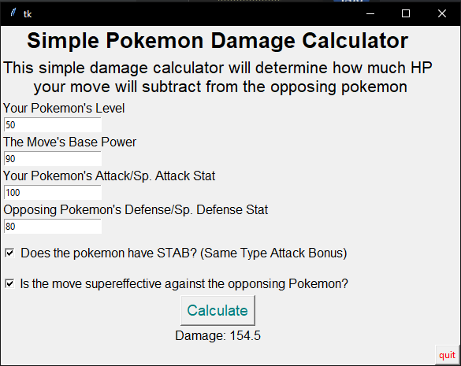
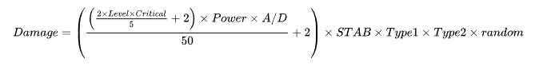

This is a rudementary damage calculator used to simulate an attack during a battle from the famous Nintendo franchise Pokemon. The formula I used was taken directly from the pokemon games with a few variables stripped away for a more practical application. This project was done as an exercise in the use of mathematical formulas in programs, basic graphical user interface design, and connecting back-end to front-end in a project.

## The Formula used to calculate damage:

Source: <a href="https://github.com/EvanAraki/Pokemon-Damage-Calculator-">EvanAraki/Pokemon-Damage-Calculator-</a>
