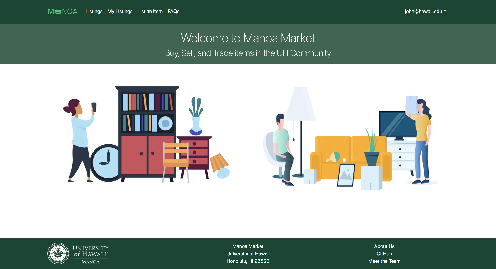
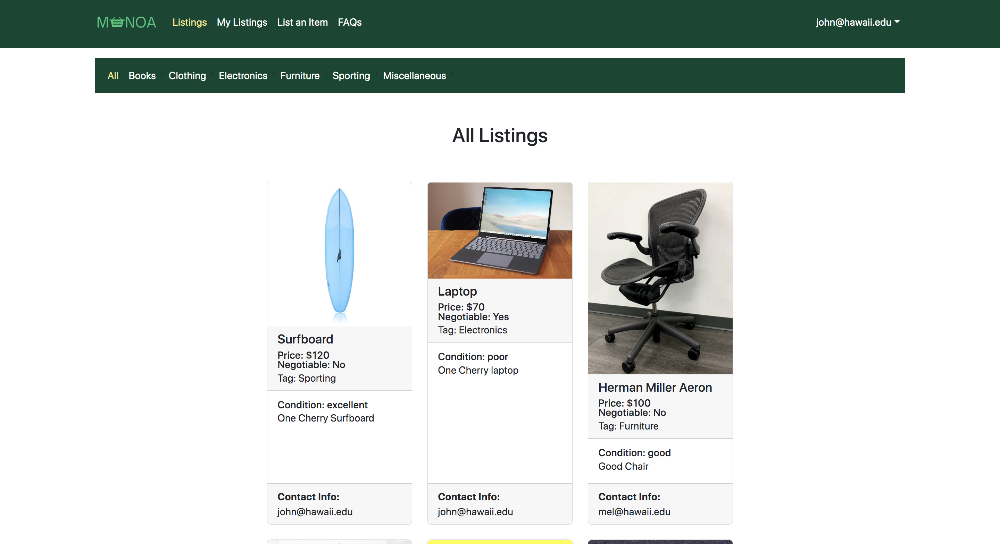

<a href="https://manoa-market.github.io/">Manoa Market</a> was implemented using Meteor, a JavaScript application platform. It is a online market where users can buy and sell used items that are college-life specific. Users can create listings for their items and potential buyers can browse other's listings, sorting by catefory as needed.

In this project I gained experience with full-stack web application design and associated technologies, including MongoDB for database storage, the React Bootstrap CSS Framework for the user interface, and Javascript for both client and server-side programming.

Agile Project Management was our team's approach to developing this website. We broke up our project into smaller projects(milestones), it allowed the team to focus on each feature of the site without getting too overwhelmed. We also had fellow students at UH test out our project and provide feedback whether it be positive or negative to determine whether or not properties needed further improvements.

