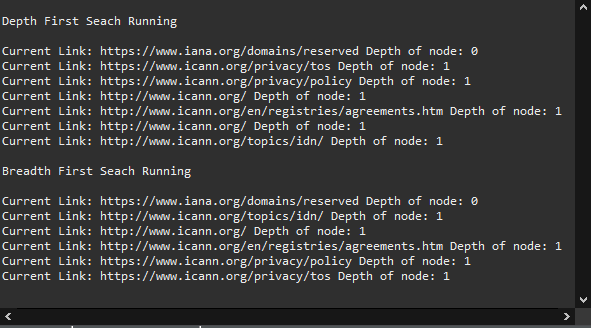
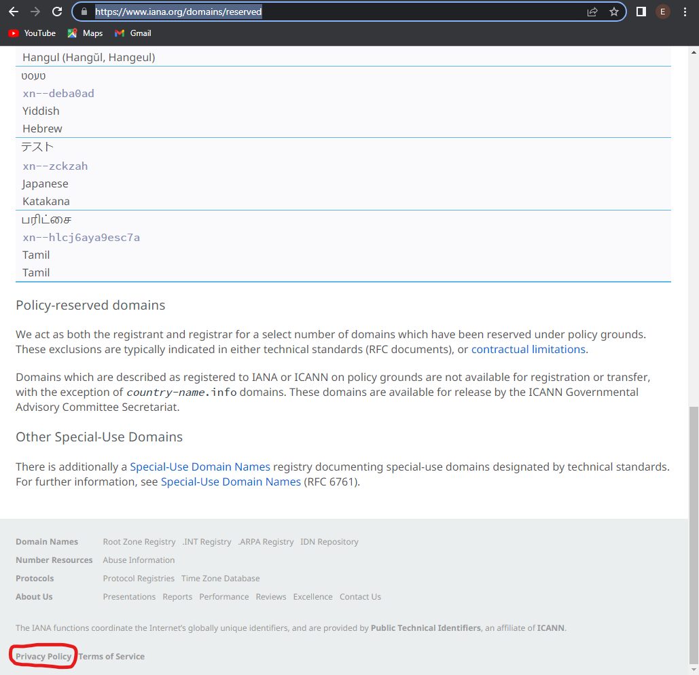
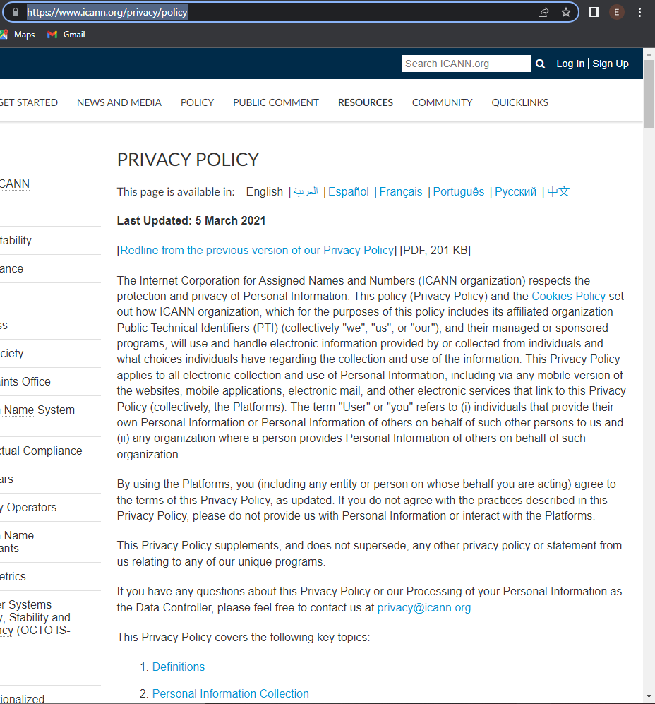

This program is a simple web crawler that takes a webpage URL and an interger for the depth of the search to be performed and applies two different tree traversal methods to access more webpages through the hyperlinks found on the original page. The program constructs a graph with the read hyperlinks as nodes and traverses it using a breadth first search and a depth first search. 

A screenshot of the code running 

Here's the starting page. One of the first links scanned in the search is the privacy policy

Here's what it looks like when you visit the url scanned by the Webcrawler, it is a real link to a real page 

